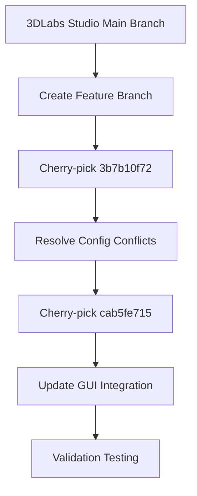

# ADR 0005: Implementation of Counterbore Hole Bridging Feature

## Status
Proposed (2024-04-13)

## Context
We need to integrate OrcaSlicer's counterbore hole bridging functionality to enable support-free printing of counterbored holes. This feature was implemented in OrcaSlicer through:
- Initial implementation: 3b7b10f72 (Port "No Unsupported Perimeters" feature)
- Critical fix: cab5fe715 (Parameter name correction)

## Decision
We will merge the feature using a targeted cherry-pick approach:



### Implementation Details
1. **Core Files**:
   - `src/libslic3r/PrintConfig.cpp`: Enum definitions and parameter mapping
   - `src/libslic3r/PerimeterGenerator.cpp`: Bridging algorithm implementation
   - `src/slic3r/GUI/Tab.cpp`: Settings panel integration

2. **Expected Conflicts**:
   - PrintConfig enum declarations
   - CMake build system differences
   - GUI layout collisions in print settings

## Consequences
### Positive
- Adds support for bridging counterbored holes without supports
- Maintains compatibility with existing user presets
- Leverages proven implementation from upstream

### Risks
- Potential conflicts with our modified perimeter generation system
- Requires validation of bridge detection algorithms
- May affect existing support structure logic

## Validation Plan
1. **Unit Tests**:
```bash
ctest -R PerimeterGeneratorTest -VV
```

2. **Visual Verification**:
```bash
./build/src/3DLabsStudio.exe test_models/counterbore_calibration.stl
```

3. **G-code Inspection**:
```python
# Sample validation script
import re
with open('output.gcode') as f:
    bridges = re.findall(r'; BRIDGE_COUNTERBORE.*', f.read())
print(f"Detected {len(bridges)} counterbore bridges")
```

## References
- Original OrcaSlicer PR: [#3189](https://github.com/SoftFever/OrcaSlicer/pull/3189)
- Parameter Fix Commit: cab5fe715
