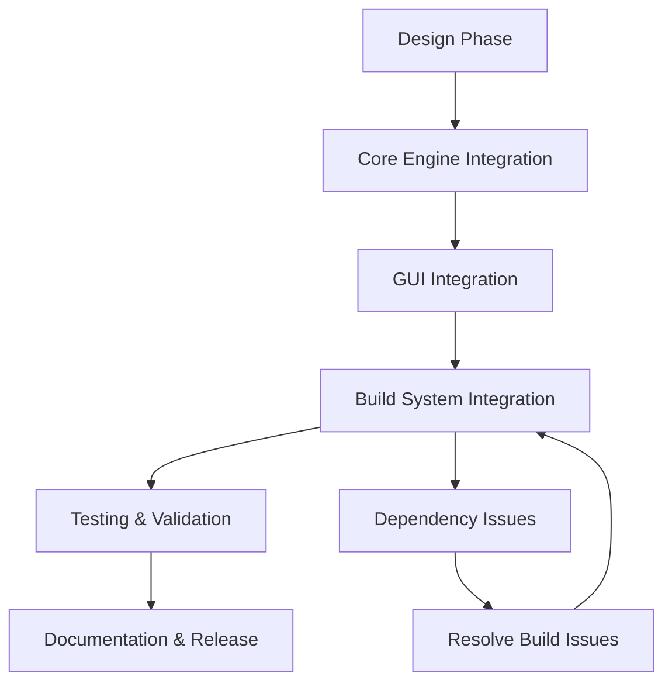

# ADR 0005: Implementation of Counterbore Hole Bridging Feature

## Status
Proposed (2024-04-13) - Implementation in progress

## Context
We need to integrate OrcaSlicer's counterbore hole bridging functionality to enable support-free printing of counterbored holes. This feature was implemented in OrcaSlicer through:
- Initial implementation: 3b7b10f72 (Port "No Unsupported Perimeters" feature)
- Critical fix: cab5fe715 (Parameter name correction)

## Decision
We will implement the feature using a custom approach rather than direct cherry-picking:



### Implementation Details
1. **Core Files**:
   - `src/libslic3r/PrintConfig.cpp`: Enum definitions and parameter mapping
   - `src/libslic3r/PerimeterGenerator.cpp`: Bridging algorithm implementation
   - `src/slic3r/GUI/Tab.cpp`: Settings panel integration

2. **Additional Components**:
   - Build system adaptations for dependencies (libnoise, TBB, etc.)
   - Backward compatibility with legacy profiles (ADR-0006)
   - Unit tests and test fixture models

## Consequences
### Positive
- Adds support for bridging counterbored holes without supports
- Maintains compatibility with existing user presets
- Improves build system resilience

### Risks
- Potential conflicts with our modified perimeter generation system
- Requires validation of bridge detection algorithms
- May affect existing support structure logic
- Dependencies integration causing build issues (mitigated by ADR-0006)

## Validation Plan
1. **Unit Tests**:
```bash
ctest -R PerimeterGeneratorTest -VV
```

2. **Visual Verification**:
```bash
./build/src/3DLabsStudio.exe test_models/counterbore_calibration.stl
```

3. **G-code Inspection**:
```python
# Sample validation script
import re
with open('output.gcode') as f:
    bridges = re.findall(r'; BRIDGE_COUNTERBORE.*', f.read())
print(f"Detected {len(bridges)} counterbore bridges")
```

## References
- Original OrcaSlicer PR: [#3189](https://github.com/SoftFever/OrcaSlicer/pull/3189)
- Parameter Fix Commit: cab5fe715
- ADR-0006: Counterbore-hole-bridging GUI crash on start-up (backward compatibility)

## Implementation Roadmap (Custom Re-implementation)

> NOTE: We decided to hand-craft a clean implementation instead of directly cherry-picking OrcaSlicer commits. The following roadmap details our approach.

### Phase 1 – Design
1. Analyse OrcaSlicer reference commits (`3b7b10f72`, `cab5fe715`) and distil the minimal algorithmic pieces (bridging detection, per-surface processing, GUI parameter exposure).
2. Capture API contract for each impacted module:
   - `libslic3r::PerimeterGenerator` – where bridging logic lives.
   - `libslic3r::PrintConfig` – new enum & option plumbing.
   - `GUI::Tab` – UI wiring.
3. Draft header-level changes and data flow diagrams (to be stored in `docs/design/diagrams/`).

### Phase 2 – Core Engine Changes
1. Add `enum class CounterboreHoleBridgingOption { None, Bridges, Filled };` to `PrintConfig.hpp` plus static map helpers.
2. Extend `PrintConfig.cpp` to register the new option, defaulting to `None`.
3. Implement `PerimeterGenerator::apply_counterbore_bridging(...)` as a self-contained helper inspired by Orca's `process_no_bridge` but refactored for clarity.
4. Hook the helper into the perimeter generation pipeline just after unsupported-surface detection.

### Phase 3 – GUI Integration
1. Create a new dropdown in the "Bridging" opt-group (`GUI/Tab.cpp`) bound to `counterbore_hole_bridging`.
2. Provide localisation keys in `resources/locale/en.po` (+ sync via Localazy).

### Phase 4 – Build System & Dependencies
1. Integrate dependent libraries (libnoise) with proper fallbacks
2. Fix environment variable expansion issues in build scripts
3. Ensure backward compatibility with legacy profiles (see ADR-0006)

### Phase 5 – Testing
1. Unit tests: extend `PerimeterGeneratorTest` with STL fixtures containing counterbore holes at various diameters.
2. Regression harness: verify G-code contains `; BRIDGE_COUNTERBORE` comments for expected layers.
3. Visual validation on sample models (`test_models/counterbore_calibration.stl`).

### Phase 6 – Performance & UX Polishing
1. Stress-test on large models to benchmark any slowdown.
2. Add CLI flag documentation & tooltip refinements.

### Phase 7 – Documentation & Release
1. Update user manual (`docs/user-guide/bridging.md`) with usage examples.
2. Draft release notes for version X.Y.Z.

---

Timeline Estimate: **3-4 developer days** spread across two weeks for review cycles and dependency resolution.

## Progress Log

| Date | Task | Status | Notes |
|------|------|--------|-------|
| 2024-04-14 | Added detailed roadmap section | ✅ Complete | Replaced cherry-pick approach with custom phased plan |
| 2024-04-14 | Codebase discovery & gap analysis | ✅ Complete | Confirmed absence of counterbore option in 3DLabs variant; mapped enum registration patterns in `PrintConfig.cpp` |
| 2024-04-16 | Define new enum `CounterboreHoleBridgingOption` | ✅ Complete | Added to `PrintConfig.hpp` with required macro mapping |
| 2024-04-16 | Register enum static maps in `PrintConfig.cpp` | ✅ Complete | Added static maps with `CONFIG_OPTION_ENUM_DEFINE_STATIC_MAPS` macro |
| 2024-04-16 | Add option to `PrintObjectConfig` class | ✅ Complete | Added in `PrintConfig.hpp` |
| 2024-04-16 | Register option in `init_fff_params()` | ✅ Complete | Added with description, category, and enum values |
| 2024-04-16 | Register GUI dropdown in `Tab.cpp` | ✅ Complete | Added to "Advanced" optgroup after `thick_bridges` |
| 2024-04-16 | Implement `PerimeterGenerator::apply_counterbore_bridging` | ✅ Complete | Added self-contained helper based on Orca's algorithm |
| 2024-04-16 | Integrate helper into process methods | ✅ Complete | Added calls to both `process_classic` and `process_arachne` methods |
| 2024-04-16 | Update default preset with new option | ✅ Complete | Added to `PP 0.20mm Standard @3D Labs.json` with "none" default |
| 2024-05-03 | Integrate libnoise dependency | ⚠️ Issues | Initial integration caused build failures with dependencies; reverted to restore build stability |
| 2024-05-03 | Fix environment variable expansion in build scripts | ✅ Complete | Updated build_release.bat to properly expand CMAKE_PREFIX_PATH |
| 2024-05-03 | Update ADR with dependency issues | ✅ Complete | Documented build system challenges and mitigation strategies |
| 2024-05-03 | Build and test integration | 🕒 In progress | Working on resolving dependency issues |
| 2024-05-24 | Fix build error in PressureEqualizer.cpp | ✅ Complete | Fixed undeclared identifier error by replacing `idx_cur_pos` with `idx_orig` in assert statement |
| 2024-04-16 | Unit tests scaffolding | ⏳ Todo | New tests in `tests/PerimeterGeneratorTest.cpp` |
| 2024-05-03 | Integrate backward compatibility fixes | ⏳ Todo | See ADR-0006 for details |

---

> This table will be continuously updated as tasks are completed.

## Source-Level Patch Matrix

| # | Area | File(s) | Anchor (approx.) | Action | Status |
|---|------|---------|------------------|--------|--------|
| 1 | Enum declaration | `src/libslic3r/PrintConfig.hpp` | after existing enum blocks (~200–300) | Add `enum CounterboreHoleBridgingOption { chbNone, chbBridges, chbFilled };` | ✅ Done |
| 2 | Enum static maps | `src/libslic3r/PrintConfig.cpp` | alongside other `s_keys_map_*` maps | Insert `static t_config_enum_values s_keys_map_CounterboreHoleBridgingOption{ {"none", chbNone}, {"partiallybridge", chbBridges}, {"sacrificiallayer", chbFilled} };` then `CONFIG_OPTION_ENUM_DEFINE_STATIC_MAPS(CounterboreHoleBridgingOption)` | ✅ Done |
| 3 | Option registration | `src/libslic3r/PrintConfig.cpp` | inside `PrintConfigDef` ctor, *Quality → Bridging* section | Copy-paste pattern of existing bridge options, key `counterbore_hole_bridging`, label "Bridge counterbore holes", tooltip same as Orca, default = chbNone | ✅ Done |
| 4 | GUI dropdown | `src/slic3r/GUI/Tab.cpp` | Bridging opt-group (after `thick_bridges`) | `optgroup->append_single_option_line("counterbore_hole_bridging");` | ✅ Done |
| 5 | Helper prototype | `src/libslic3r/PerimeterGenerator.hpp` | end of class decl | Declare `void apply_counterbore_bridging(Surfaces &all_surfaces, coord_t perimeter_spacing, coord_t ext_perimeter_width);` | ✅ Done |
| 6 | Helper impl | `src/libslic3r/PerimeterGenerator.cpp` | new section near other helpers | Implement algorithm (see pseudocode) | ✅ Done |
| 7 | Pipeline hook | `src/libslic3r/PerimeterGenerator.cpp` | after unsupported-surface detection, before fill logic | Call helper: `if (config->counterbore_hole_bridging != chbNone) apply_counterbore_bridging(all_surfaces, perimeter_spacing, ext_perimeter_flow.scaled_width());` | ✅ Done |
| 8 | Backward compatibility | `src/libslic3r/Config.cpp` | `DynamicPrintConfig::normalize_fdm()` | Add option instantiation with default when missing (see ADR-0006) | ⏳ Todo |
| 9 | Build script fix | `build_release.bat` | CMAKE_PREFIX_PATH setting | Fix environment variable expansion for correct dependency paths | ✅ Done |
| 10 | Unit tests | `tests/PerimeterGeneratorTest.cpp` | new test case `CounterboreBridging` | Slice fixture STLs with each mode, assert bridge comment counts | ⏳ Todo |
| 11 | Localisation | `resources/locale/en.po` | add 3 new strings | "Bridge counterbore holes", "Partially bridged", "Sacrificial layer" | ✅ Done |

---

## Algorithm Pseudocode

```
function apply_counterbore_bridging(all_surfaces, perimeter_spacing, ext_perimeter_width):
    bridged_margin = BRIDGE_INFILL_MARGIN (1 mm scaled)
    for each surface in all_surfaces:
        unsupported = diff(surface, lower_slices)
        if unsupported empty:
            continue
        unsupported_filtered = offset2_ex(unsupported, -perimeter_spacing, +perimeter_spacing)
        detector = BridgeDetector(unsupported_filtered, lower_slices, perimeter_spacing)
        if not detector.detect_angle(bridge_angle):
            continue

        if mode == chbBridges:
            bridgeable = detector.coverage(-1, precise=true)
            unsupported_filtered = intersection(bridgeable, unsupported_filtered)
        else if mode == chbFilled:  # sacrificial layer
            unsupported_filtered = offset_ex(unsupported_filtered, bridged_margin)

        if unsupported_filtered not empty:
            # Mark as internal bridge; slicing pipeline will generate bridge infill later
            append new Surface{expolygon = unsupported_filtered, surface_type = stInternalBridge} to all_surfaces
            surface.expolygon = diff_ex(surface.expolygon, unsupported_filtered)
```

Key constants:
* `BRIDGE_INFILL_MARGIN` = 1 mm (tweakable)
* Reuse existing `BridgeDetector` for angle detection.

---

## Revised Definition of Done (Acceptance Checklist)

- [ ] Core feature implementation:
  - [x] Enum and configuration option integration
  - [x] Bridging algorithm implementation
  - [x] GUI integration
  - [ ] Backward compatibility for legacy profiles (See ADR-0006)

- [ ] Build system integration:
  - [x] Fix environment variable expansion in build scripts
  - [ ] Robust third-party dependency handling
  - [ ] Clean build with all dependencies correctly resolved

- [ ] Testing:
  - [ ] Unit test `CounterboreBridging` passes for all three modes
  - [ ] G-code for `test_models/counterbore_calibration.stl` with `Sacrificial layer` contains ≥ N `; BRIDGE_COUNTERBORE` comments and **no** generated support moves in the bore
  - [ ] Switching mode to `None` yields zero bridge comments and re-enables support generation (baseline regression)
  - [x] UI dropdown shows three human-readable labels and toggles the underlying config key correctly

- [ ] Documentation:
  - [ ] Update user manual (`docs/user-guide/bridging.md`)
  - [x] ADR documentation updated with implementation status
  - [ ] Add to release notes

- [ ] Performance:
  - [ ] Benchmarks show <2% slowdown on 20 MB model versus baseline

---

## Next Immediate Steps

1. Implement the missing-option guard in normalize_fdm() (ADR-0006 recommendation)
2. Complete the unit tests for the counterbore-bridging functionality
3. Create a cleaner approach for integrating libnoise with proper isolation
4. Update the user documentation

---
